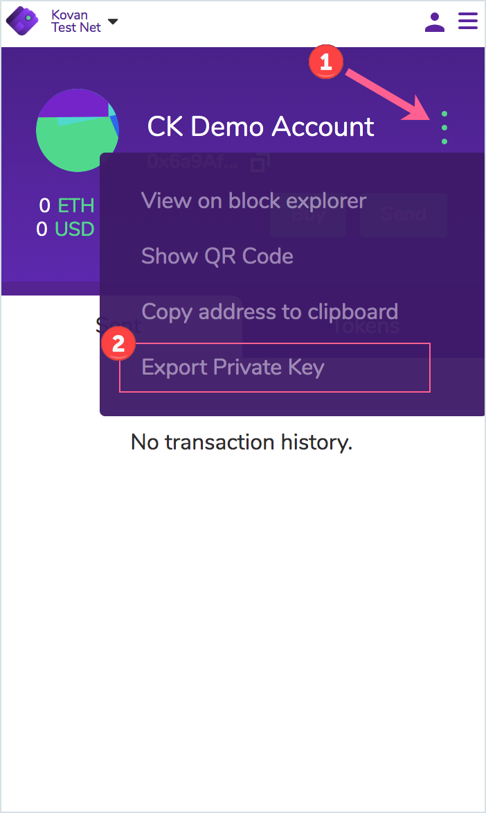
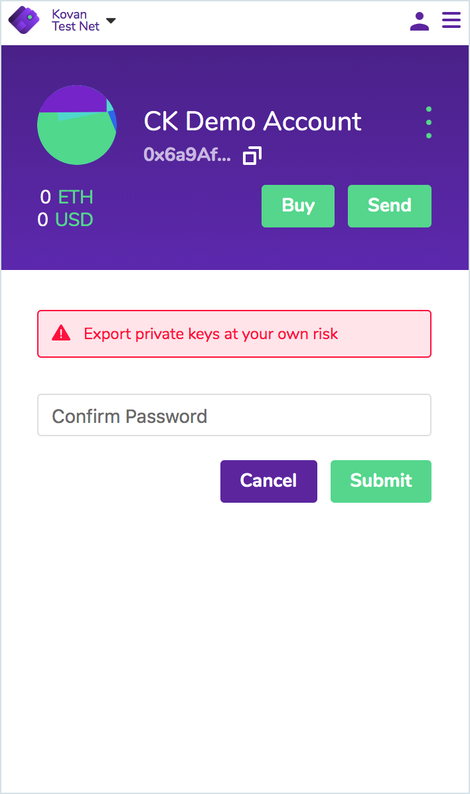
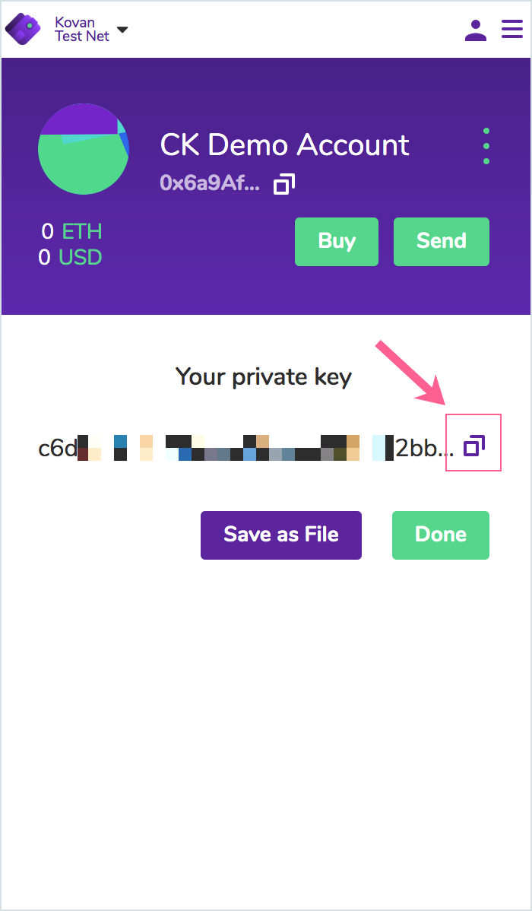

# Deploy CryptoKitty Contracts

To create your own CryptoKitties to send across the bridge, you need to deploy your own set of contracts. Only the contract owner can create new kitties. You can create a group of kitties during the deployment process using an env variable.

In this example, we will deploy contracts to the Kovan & Sokol testnets. You will need a small amount of test currency in your wallet for both testnets in order to deploy the contracts.

* [Kovan Faucet](https://faucet.kovan.network/) \(Github account required. If prefered, you can get KETH through the [gitter channel](https://gitter.im/kovan-testnet/faucet)\)
* [Sokol Faucet](https://faucet-sokol.herokuapp.com/)


We use [Nifty Wallet](https://chrome.google.com/webstore/detail/nifty-wallet/jbdaocneiiinmjbjlgalhcelgbejmnid?hl=en) for the demonstration. Similar functionality can be achieved with MetaMask. Note that Nifty Wallet & MetaMask cannot be active extensions at the same time.


## **1\) Clone Repository**


Prerequisites

* [yarn v 1.19.1](https://yarnpkg.com/lang/en/docs/install/#mac-stable) \(brew install yarn\)
* [Node](https://nodejs.org/en/download/) versions either: ^8.10.0 \|\| ^10.13.0 \|\|\| &gt;=11.10.1


```text
$ git clone --recursive https://github.com/poanetwork/cryptokitties-xdai-demo.git
```

## 2\) Install Dependencies

```bash
$ cd cryptokitties-xdai-demo
$ yarn
```

## 3\) Compile Contracts

```text
$ yarn compile
```

## 4\) Create a .env file in the root directory 

```text
$ nano .env
```

## 5\) Paste/Change example parameters

Copy the following into the .env file,  change parameters as needed and save.


Parameters to change based on your address information are noted with a &lt;&gt;. Notes and explanations are below the example file.


```text
#The private key hex value of the account responsible for contracts deployment
DEPLOYMENT_ACCOUNT_PRIVATE_KEY=<YOUR PRIVATE WALLET KEY>
# Extra gas added to the estimated gas of a particular deployment/configuration transaction
DEPLOYMENT_GAS_LIMIT_EXTRA=0.2
# The RPC channel to a Home node able to handle deployment/configuration transactions.
HOME_RPC_URL=https://sokol.poa.network
# The "gasPrice" parameter set in every deployment/configuration transaction on Home network (in Wei).
HOME_DEPLOYMENT_GAS_PRICE=1000000000
# The address of the existing AMB bridge in the Home network that will be used to pass messages
# to the Foreign network.
HOME_AMB_BRIDGE=0xFe446bEF1DbF7AFE24E81e05BC8B271C1BA9a560
# The gas limit that will be used in the execution of the message passed to the mediator contract
# in the Foreign network.
HOME_MEDIATOR_REQUEST_GAS_LIMIT=1000000
# Address on Home network with permissions to change parameters of the mediator contract.
HOME_MEDIATOR_OWNER=<YOUR WALLET OWNER ADDRESS>
# Address on Home network with permissions to upgrade the mediator contract
HOME_UPGRADEABLE_ADMIN=<YOUR WALLET OWNER ADDRESS>

# The RPC channel to a Foreign node able to handle deployment/configuration transactions.
FOREIGN_RPC_URL=https://kovan.infura.io
# The "gasPrice" parameter set in every deployment/configuration transaction on Foreign network (in Wei).
FOREIGN_DEPLOYMENT_GAS_PRICE=1000000000
# The address of the existing AMB bridge in the Foreign network that will be used to pass messages
# to the Home network.
FOREIGN_AMB_BRIDGE=0xFe446bEF1DbF7AFE24E81e05BC8B271C1BA9a560
# The gas limit that will be used in the execution of the message passed to the mediator contract
# in the Home network.
FOREIGN_MEDIATOR_REQUEST_GAS_LIMIT=1000000
# Address on Foreign network with permissions to change parameters of the mediator contract.
FOREIGN_MEDIATOR_OWNER=<YOUR WALLET OWNER ADDRESS>
# Address on Foreign network with permissions to upgrade the mediator contract
FOREIGN_UPGRADEABLE_ADMIN=<YOUR WALLET OWNER ADDRESS>

# Cryptokitties contract address on Foreign network. If not defined or set to address zero, the contract will be deployed on Foreign network.
CRYPTOKITTIES_ADDRESS=0x0000000000000000000000000000000000000000
# Amount of Kitties to Mint on Foreign network
KITTIES_AMOUNT=15

```

### Parameter Notes:

* DEPLOYMENT\_ACCOUNT\_PRIVATE\_KEY=**&lt;Your Private Wallet Key&gt;**: This is the key associated with the account deploying the contracts. This wallet must have both test Ether and test POA. **To retrieve a private key from Nifty Wallet:** 
* Go to the deployment account and click the dots next to the account name. Select **Export Private Key.**



* Enter in your Nifty Wallet password:



* Copy your private key.



* HOME\_AMB\_BRIDGE=**0xFe446bEF1DbF7AFE24E81e05BC8B271C1BA9a560**: This is the address for the [currently deployed AMB bridge on the Sokol network](https://blockscout.com/poa/sokol/address/0xfe446bef1dbf7afe24e81e05bc8b271c1ba9a560/contracts). If you deploy elsewhere, use your deployed address address. 
* HOME\_MEDIATOR\_OWNER=**&lt;YOUR WALLET OWNER ADDRESS&gt;**: You should have access to this wallet address so you can create a kitty later if needed. The following &lt;YOUR WALLET OWNER ADDRESS&gt; parameters can use the same address for the purposes of this tutorial.  For more information, see [TokenBridge roles](../../bridge-fundamentals/tokenbridge-roles.md). 
* FOREIGN\_AMB\_BRIDGE=**0xFe446bEF1DbF7AFE24E81e05BC8B271C1BA9a560**:  This is the address for the [currently deployed AMB bridge on the Kovan network.](https://blockscout.com/eth/kovan/address/0xfe446bef1dbf7afe24e81e05bc8b271c1ba9a560/contracts) If you deploy elsewhere, use your deployed address. 
* KITTIES\_AMOUNT=**15**: This is the number of kitties minted by the contract, select any number here. You can send these to other addresses or bridge yourself.

## 6\) Deploy Contracts

```bash
$ yarn deploy
```

On successful deployment, you will receive confirmation of the contract addresses: For example:

```text
[ Home ] homeMediator: 0x5EeC77239398FE328791E28700CAFddB2990ea97
[ Home ] simpleKittyCore: 0xc6a592ED792de33e6CBBF7ce04Dd9D3884B46B9A
[ Foreign ] foreignMediator: 0x7dB6493D9B6D99D9A240a6914AdAd5e0E8E8BE40
[ Foreign ] kittyCore: 0x13AC5C6338796a31A39e74D70B0153C1bE5f53B4
```

In our example, **Sokol** is the **Home** network, and **Kovan** is the **Foreign** Network. This means CryptoKitties are **deployed on Kovan**, and can be **transferred to Sokol** following the next instructions. Once they are bridged to Sokol, they can be bridged back to Kovan as well. 

* See [View Kitties in BlockScout](view-in-blockscout.md) to view the kitties you have created.

### [&gt; Next: Verify Contracts in BlockScout](verify-contracts-in-blockscout.md)


###  

