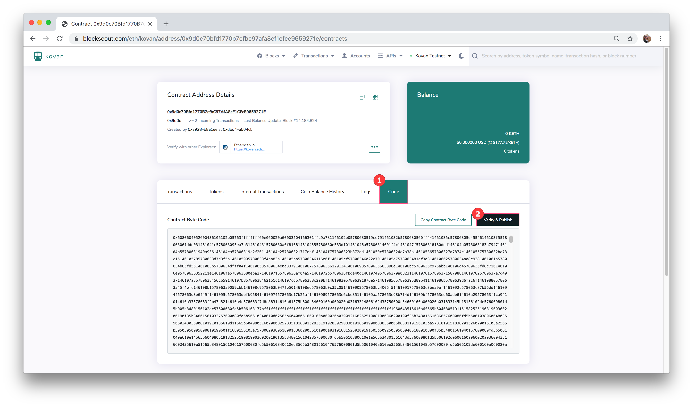
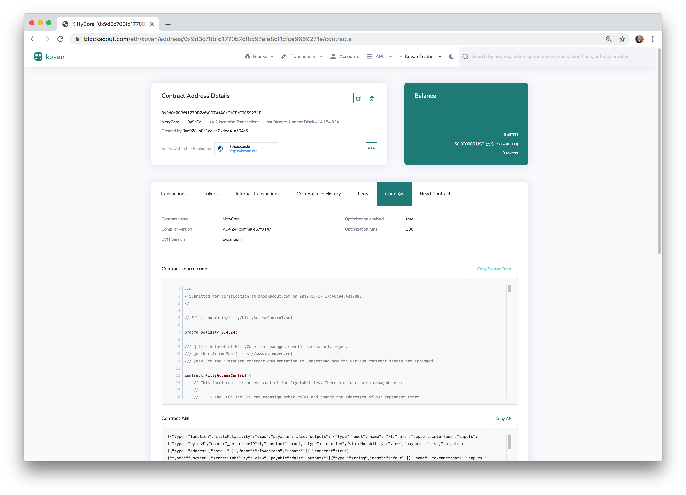
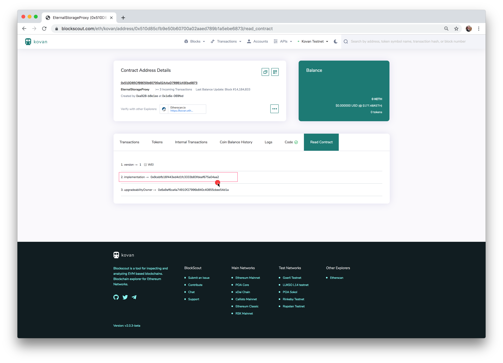

# Verify Contracts in BlockScout

To invoke contract methods which approve and initiate token transfers, it is important to verify the newly deployed contracts. This provides access to the ABI code.

We will verify the following group of deployed contracts for this demo. You will use your own contract address output to verify your contracts.

```text
Sokol
[ Home ] homeMediator: 0xF190e4EBAF15E66869A3D8252AC48588a75EEf4e
[ Home ] simpleKittyCore: 0x8eb75AD1ab50aB28E78B62fEeDD9EBcF9F040E33

Kovan
[ Foreign ] foreignMediator: 0x510D85CfB9E50b60700a02AAeD789B1A5Ebe6873
[ Foreign ] kittyCore: 0x9d0c70Bfd1770B7cfbC97AfA8cF1CFcE9659271E
```

## 1\) Flatten Contracts

Check that you are in the root directory from deployment steps \(`cryptokitties-xdai-demo` \) and run the flatten command.

```text
yarn flatten
```

flattened contracts will be created in the `flats` folder.

## 2\) Go to Deployed KittyCore Contract in BlockScout - Kovan  

* Example url: [https://blockscout.com/eth/kovan/address/0x13AC5C6338796a31A39e74D70B0153C1bE5f53B4/transactions](https://blockscout.com/eth/kovan/address/0x13AC5C6338796a31A39e74D70B0153C1bE5f53B4/transactions).  You will replace with your \[ Foreign \] kittyCore: `0x.......` address.
* Click on the **Code** tab, then click the **Verify and publish** button.



## 3\) Enter KittyCore Contract Details

* Contract Address: **Preselected**
* Contract Name: **KittyCore**
* Compiler: **v0.4.24+commit.e67f0147**
* EVM Version: **byzantium**
* Optimization: **Yes**
* Optimization runs: **200**
* Enter the Solidity Contract code:  **copy code from** `cryptokitties-xdai-demo/flats/kitty/KittyCore_flat.sol`
* ABI-encoded Constructor Arguments: **leave blank**

Click **Verify & publish**.


Verification parameters are located in the truffle-config file in the root directory. [https://github.com/poanetwork/cryptokitties-xdai-demo/blob/master/truffle-config.js\#L83-L94](https://github.com/poanetwork/cryptokitties-xdai-demo/blob/master/truffle-config.js#L83-L94)



On success, you will see the verified contract. It will include the contract name under details, along with a ✅ next to the code tab and the ability to Read the Contract.



## 4\) Go to Deployed ForeignMediator Proxy Contract in BlockScout - Kovan  

* Example url: [https://blockscout.com/eth/kovan/address/0x510D85CfB9E50b60700a02AAeD789B1A5Ebe6873/transactions](https://blockscout.com/eth/kovan/address/0x510D85CfB9E50b60700a02AAeD789B1A5Ebe6873/transactions) .  You will replace with your \[ Foreign \] foreignMediator: `0x.......` address.
* Click on the **Code** tab, then click the **Verify and Publish** button.

## 5\) Enter Mediator Proxy Contract Details


Mediator contracts are actually proxy contracts - so you will verify the flatted proxy contract located at: `cryptokitties-xdai-demo/flats/upgradeability/EternalStorageProxy_flat.sol`


* Contract Address: **Preselected**
* Contract Name: **EternalStorageProxy**
* Compiler: **v0.4.24+commit.e67f0147**
* EVM Version: **byzantium**
* Optimization: **Yes**
* Optimization runs: **200**
* Enter the Solidity Contract code:  **copy code from** 

  `cryptokitties-xdai-demo/flats/upgradeability/EternalStorageProxy_flat.sol`

* ABI-encoded Constructor Arguments: **leave blank**

Click **Verify & publish**

On success, you will see the verified contract. It will include the contract name under details, along with a ✅ next to the code tab and the ability to Read the Contract.

## **6\) Locate and Verify Additional ForeignMediator Contract**

Because the previous contract is a proxy contract, you must also find the ForeignMediator contract as well to verify. 

1\) After the **EternalStorageProxy** contract has been verified, go to the **Read Contract** Tab  
2\) You will see a 2. implementation -&gt; `0x.....`  row. Click on that **implementation address**.



## 7\) Verify ForeignMediator Contract

* Click on the **Code** tab, then click the **Verify and Publish** button

**Verification Details**

* Contract Address: **Preselected**
* Contract Name: **ForeignMediator**
* Compiler: **v0.4.24+commit.e67f0147**
* EVM Version: **byzantium**
* Optimization: **Yes**
* Optimization runs: **200**
* Enter the Solidity Contract code:  **copy code from** 

  `cryptokitties-xdai-demo/flats/mediator/ForeignMediator_flat.sol`

* ABI-encoded Constructor Arguments: **leave blank**

Click **Verify & publish**

On success, you will see the verified contract. It will include the contract name under details, along with a ✅ next to the code tab and the ability to Read the Contract.

## 8\) Verify Remaining Contracts in Sokol

You will now follow the same steps to verify the contracts on the **Sokol Testnet**  
[https://blockscout.com/poa/sokol](https://blockscout.com/poa/sokol) 

#### SimpleKittyCore Parameters

* Contract Address: **Preselected**
* Contract Name: **SimpleBridgeKitty**
* Compiler: **v0.4.24+commit.e67f0147**
* EVM Version: **byzantium**
* Optimization: **Yes**
* Optimization runs: **200**
* Enter the Solidity Contract code:  **copy code from** `cryptokitties-xdai-demo/flats/simpleKitty/SimpleBridgeKitty_flat.sol`
* ABI-encoded Constructor Arguments: **leave blank**

#### Mediator Proxy Contract Parameters


We use the same proxy contract on both chains.


* Contract Address: **Preselected**
* Contract Name: **EternalStorageProxy**
* Compiler: **v0.4.24+commit.e67f0147**
* EVM Version: **byzantium**
* Optimization: **Yes**
* Optimization runs: **200**
* Enter the Solidity Contract code:  **copy code from** 

  `cryptokitties-xdai-demo/flats/upgradeability/EternalStorageProxy_flat.sol`

* ABI-encoded Constructor Arguments: **leave blank**

#### HomeMediator Parameters

* Contract Address: **Preselected**
* Contract Name: **HomeMediator**
* Compiler: **v0.4.24+commit.e67f0147**
* EVM Version: **byzantium**
* Optimization: **Yes**
* Optimization runs: **200**
* Enter the Solidity Contract code:  **copy code from** 

  `cryptokitties-xdai-demo/flats/mediator/HomeMediator_flat.sol`

* ABI-encoded Constructor Arguments: **leave blank**

## 9\) Proceed to Transfer Operations


Once contracts are verified, methods are exposed to [NiftyWallet](niftywallet-transfer.md) or [MEW](myetherwallet-mew-transfer.md). You can proceed to either of these tutorials, or [view your Kitties in BlockScout](view-in-blockscout.md).



